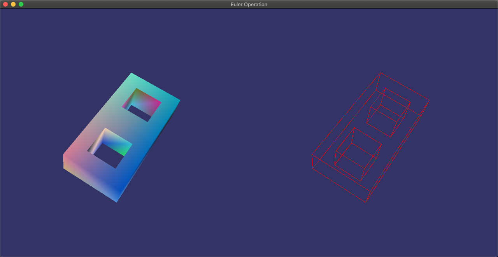
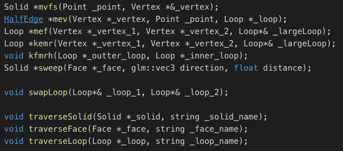
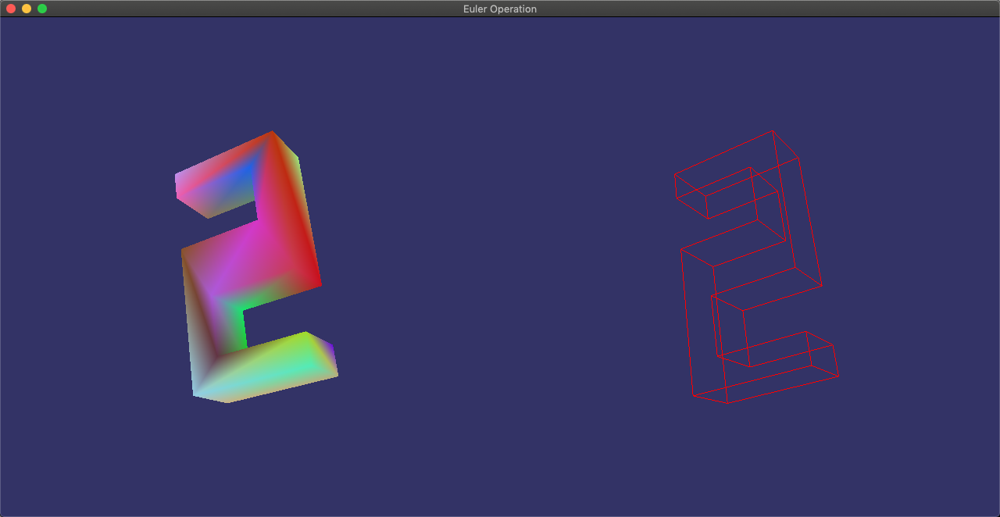

# EulerOperation

三维CAD作业，实现了5个基本的欧拉操作(`mvfs`,`mev`,`mef`,`kemr`,`kfmrh`)和`sweep`扫成操作。



## 项目说明

源代码放在`/src`目录下，包含了绘制部分，欧拉操作部分，样例的构造部分，和一些控制部分。

### 编译方法

安装好需要的框架`GLFW`,`GLEW`,`GLUT`后

```bash
cmake .
make
```

> 本项目经过在MacOS Mojave 10.14.1测试，如果遇到黑屏，请最小化后再打开。

### 操作说明

**键盘输入**
`wasd`控制物体的旋转
`n`切换物体

## 增加物体方法

本Demo中展示了三个物体的欧拉操作过程，分别是数字`1`,`2`,`8`,`0`。选择这三个数字的原因是，`1`是最简单的物体，可以展示基础的构造过程。`2`是一个非凸的多边形，这里使用了`sweep`操作进行扫成构造了这个数字。
`0`是一个典型的带通孔的物体，`8`带有两个通孔，可以展示通孔的构造方法。

在`/src/EulerOperationTest.hpp`中有这几个物体的构造过程，可以自行添加更多的物体放在main函数中，添加到`solidList`中显示出来。

## 心得与体会

* 这次作业让我深入了解了实体造型所使用的数据结构和算法。让我对五个基本的欧拉操作算法有了更加深入的了解。同时为了更好的Debug，我自己增加了一些`/src/TopologicalOperation.hpp`中增加了一些额外的函数用于辅助操作。在这次作业中，我发现要想实现好欧拉操作必须注意细节，特别是`Loop`的选择是一个非常关键的因素，如果对错误的`Loop`使用了操作，那么很有可能找不到相应的顶点`Vertex`，从而让整个物体生成失败。
* 代码的一些细节老师在上课介绍的比较详细了，只要按照这个老师说的写就好了，网上也有一些相应的介绍。



* 第二的心得是学会了OpenGL中的非凸多边形的绘制，因为虽然构造一个非凸的多边形非常简单，但是绘制时不能直接绘制非凸的多边形，例如数字`2`，此时需要将多边形细分一下，这个操作只是在绘制阶段有效，对构造没有影响，但是也是一个需要注意的地方。



